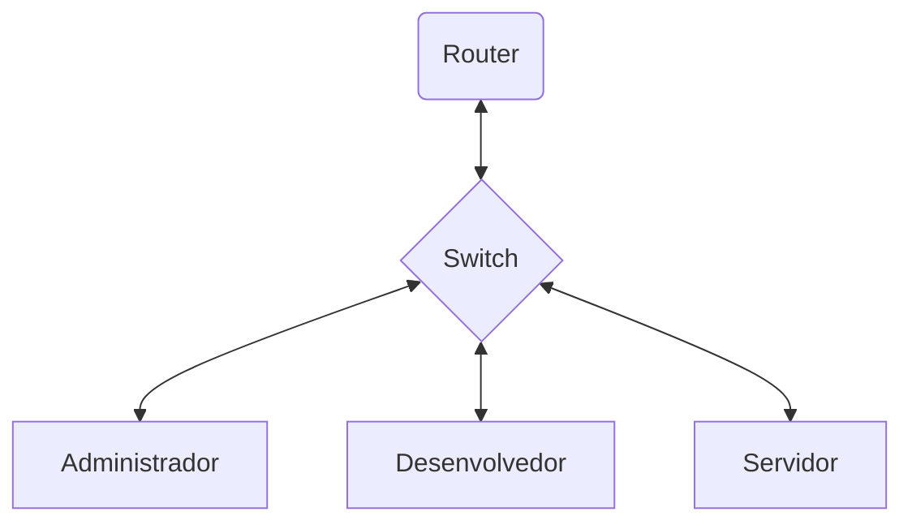
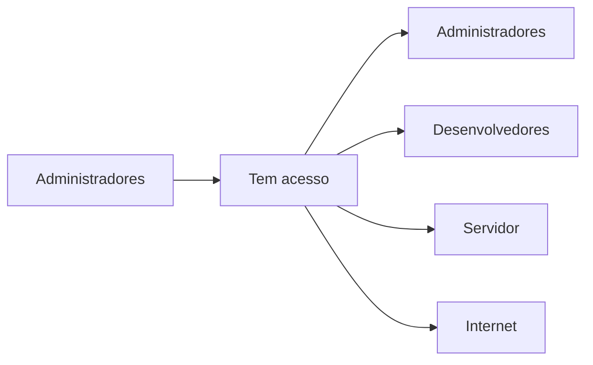
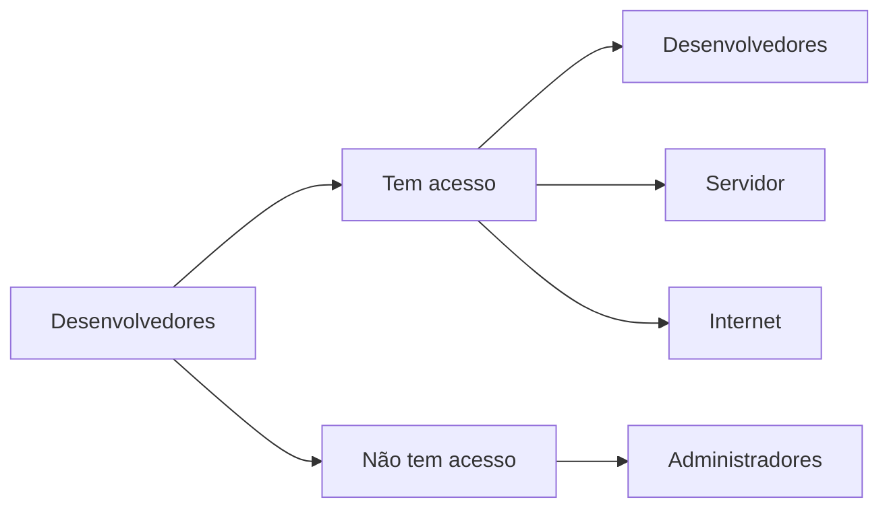
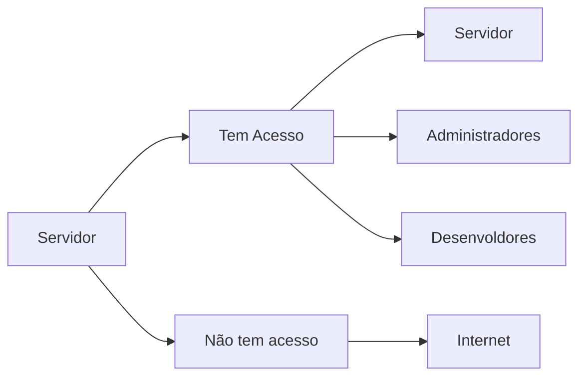
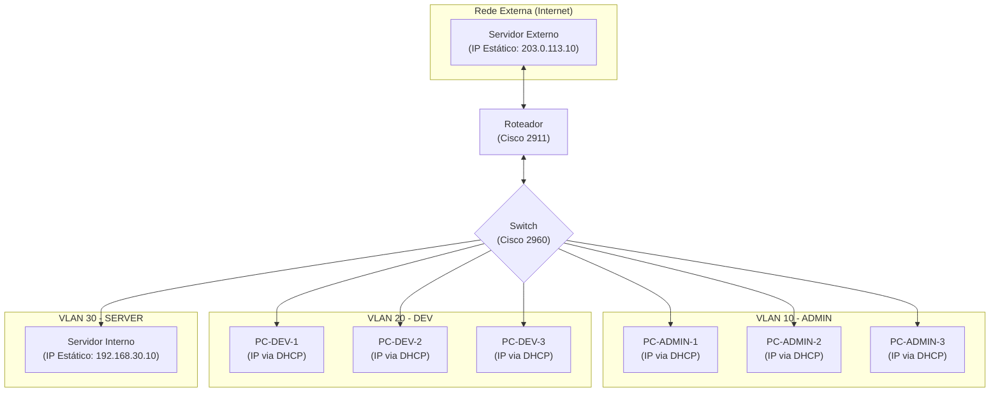

# Startup de Desenvolvimento Web - DevHub

## Descrição

A DevHub é uma startup que precisa de uma rede que conecte seus desenvolvedores, área administrativa e um servidor de hospedagem local para testes. Eles precisam de alta
disponibilidade, segurança no acesso aos servidores, e segmentação entre os setores para evitar
interferência no ambiente de desenvolvimento.

## Avaliação do Problema: Políticas de Acesso por VLAN

#### VLAN de Administração (VLAN\_ADMIN)

* **Acesso Permitido:** Acesso irrestrito à internet e a todas as outras VLANs da rede (Desenvolvedores, Servidores, etc.).
* **Acesso de Entrada:** Nenhuma outra VLAN tem permissão para iniciar comunicação com a VLAN de Administração.
* **Justificativa:** Esta VLAN possui os mais altos privilégios de acesso para garantir o total controle e gerenciamento da rede. Seu isolamento contra conexões iniciadas externamente protege a infraestrutura.

#### VLAN de Desenvolvimento (VLAN\_DEV)

* **Acesso Permitido:** Acesso liberado à internet e aos servidores internos para serviços de teste e hospedagem.
* **Acesso Bloqueado:** Comunicação iniciada com dispositivos da VLAN de Administração.
* **Justificativa:** Essa política permite que a equipe de desenvolvimento acesse os recursos necessários para seu trabalho, ao mesmo tempo que protege a rede administrativa contra acessos não autorizados.

#### VLAN de Servidores (VLAN\_SERVER)

* **Acesso Permitido:** Pode receber conexões da VLAN\_ADMIN e VLAN\_DEV para prover serviços internos.
* **Acesso Bloqueado:** Acesso à internet.
* **Justificativa:** O servidor é protegido contra tráfego externo, mas mantém conectividade interna para suportar o desenvolvimento e a administração.

<br>

---

| VLAN | Acesso à VLAN_ADMIN | Acesso à VLAN_DEV | Acesso à VLAN_SERVER | Acesso à Internet |
|-|:-:|:-:|:-:|:-:|
| Administrador |✅|✅|✅|✅|
| Desenvolvedor |❌|✅|✅|✅|
| Servidor      |✅|✅|✅|❌|


## Diagrama da Rede

### Diagrama de Comunicação: Geral



### Diagrama de Comunicação: Administradores



### Diagrama de Comunicação: Desenvolvedores



### Diagrama de Comunicação: Servidor



### Faixas de IP

A estratégia de endereçamento IP foi projetada para segmentar a rede de forma lógica e organizada. Foram utilizadas faixas de IP privadas da classe C (`192.168.x.x`), onde cada VLAN possui sua própria sub-rede para isolar o tráfego. A rede externa utiliza uma faixa de IP de documentação (`203.0.113.0/24`) para simular a conexão com a internet.

A tabela abaixo resume a alocação de endereços para cada segmento da rede.

| VLAN ID / Rede | Finalidade | Endereço de Rede | Gateway | Atribuição de IP | Observações |
| :--- | :--- | :--- | :--- | :--- | :--- |
| **VLAN 10** | Administração | `192.168.10.0/24` | `192.168.10.1` | DHCP | IPs de `.1` a `.9` reservados. |
| **VLAN 20** | Desenvolvimento | `192.168.20.0/24` | `192.168.20.1` | DHCP | IPs de `.1` a `.9` reservados. |
| **VLAN 30** | Servidores | `192.168.30.0/24` | `192.168.30.1` | Estático | IPs de `.1` a `.10` reservados para infraestrutura. |
| **VLAN 99** | Nativa do Trunk | N/A | N/A | N/A | VLAN de gerenciamento, sem dispositivos de usuário. |
| **Externa** | Simulação de Internet | `203.0.113.0/24` | `203.0.113.1` | Estático | Usada para conectar o roteador a um servidor externo. |

### Dispositivos da Rede

Esta seção detalha todos os equipamentos utilizados na topologia da DevHub, incluindo os dispositivos de infraestrutura (roteador e switch) e os dispositivos finais (servidores e computadores dos usuários).

#### Dispositivos de Infraestrutura

Os equipamentos a seguir formam o núcleo da rede, responsáveis pelo encaminhamento de pacotes, segmentação e segurança.

| Equipamento | Modelo | Função Principal |
| :--- | :--- | :--- |
| **Roteador** | Cisco 2911 ISR | Roteamento entre VLANs, Firewall (ACLs), Servidor DHCP e NAT. |
| **Switch** | Cisco Catalyst 2960 | Conexão dos dispositivos finais e segmentação da rede em VLANs. |

#### Diagrama de Topologia de Dispositivos

O diagrama abaixo ilustra a topologia da rede, agora identificando os modelos dos equipamentos de infraestrutura.



#### Dispositivos Finais (Hosts)

A tabela a seguir resume as características dos computadores e servidores conectados à rede.

| Dispositivo | VLAN / Rede | Endereço IP (Exemplo / Faixa) | Gateway | Método de Atribuição |
| :--- | :--- | :--- | :--- | :--- |
| **PC-ADMIN-1** | VLAN 10 (Admin) | `192.168.10.10` - `.254` | `192.168.10.1` | DHCP |
| **PC-ADMIN-2** | VLAN 10 (Admin) | `192.168.10.10` - `.254` | `192.168.10.1` | DHCP |
| **PC-ADMIN-3** | VLAN 10 (Admin) | `192.168.10.10` - `.254` | `192.168.10.1` | DHCP |
| **PC-DEV-1** | VLAN 20 (Dev) | `192.168.20.10` - `.254` | `192.168.20.1` | DHCP |
| **PC-DEV-2** | VLAN 20 (Dev) | `192.168.20.10` - `.254` | `192.168.20.1` | DHCP |
| **PC-DEV-3** | VLAN 20 (Dev) | `192.168.20.10` - `.254` | `192.168.20.1` | DHCP |
| **Servidor Interno** | VLAN 30 (Server) | `192.168.30.10` | `192.168.30.1` | Estático |
| **Servidor Externo**| Externa (Internet)| `203.0.113.10` | `203.0.113.1` | Estático |

### Observação Importante: Prática Recomendada para a Configuração

Para garantir a máxima segurança e eficiência da sua infraestrutura, é altamente recomendável que ambas as etapas de configuração — **Segurança** e **Funcional**  — sejam aplicadas em uma **única sessão contínua** para cada dispositivo.

**Motivo:**

Aplicar e salvar as configurações em momentos distintos cria uma janela de vulnerabilidade. Se um dispositivo for reiniciado após receber a configuração funcional, mas antes das medidas de segurança serem implementadas, ele estará online e operando sem as proteções essenciais (senhas, segurança de portas, etc.). Isso deixaria sua rede exposta a acessos não autorizados.

Portanto, a prática mais segura é inserir todos os comandos de uma só vez e executar o comando `write memory` apenas uma vez, ao final de todo o processo. Isso garante que seus dispositivos nunca estarão em um estado funcional sem estarem devidamente protegidos.

### Medidas de Segurança de Infraestrutura

A segurança da rede começa com a proteção dos seus componentes de infraestrutura. Tanto o roteador quanto o switch são pontos críticos que devem ser "endurecidos" (hardening) para prevenir acessos não autorizados e proteger a integridade da rede. Esta seção detalha as configurações de segurança de linha de base aplicadas ao roteador **Cisco 2911** e ao switch **Cisco 2960**.

#### 1. Proteção de Acesso ao Modo Privilegiado (Enable)

A medida mais crítica é proteger o acesso administrativo (modo `enable`), que concede permissões para alterar a configuração dos dispositivos. O comando `enable secret` é usado em ambos os equipamentos por sua criptografia forte.

  * **Aplicado em:** Roteador e Switch.
  * **Comando:** `enable secret <senha-forte>`

#### 2. Proteção de Acesso Físico (Porta Console)

Para impedir que qualquer pessoa com acesso físico aos equipamentos possa conectá-los e reconfigurá-los, a porta de console de ambos os dispositivos é protegida por senha.

  * **Aplicado em:** Roteador e Switch.
  * **Comandos:**

    ```bash
    line console 0
        password <senha-de-console>
        login
    ```

#### 3. Proteção de Acesso Remoto (Linhas VTY)

O acesso remoto aos dispositivos foi configurado para ser realizado **exclusivamente via SSH (Secure Shell)**, desabilitando o protocolo Telnet, que é inseguro. A autenticação não usa mais uma senha de linha simples, mas sim um banco de dados de usuários locais, garantindo que apenas usuários cadastrados possam acessar.

* **Aplicado em:** Roteador e Switch.
    * **No Roteador:** A configuração é direta.
    * **No Switch:** Foi necessário criar uma Interface Virtual (SVI) na VLAN de gerenciamento (VLAN 10) e definir um gateway padrão para permitir o acesso via rede.
* **Comandos Chave:**
    * `username admin secret <senha-forte>`: Cria um usuário local.
    * `transport input ssh`: Permite apenas conexões SSH.
    * `login local`: Força a autenticação contra o banco de dados de usuários locais.

#### 4. Criptografia de Senhas na Configuração

Para evitar que senhas fiquem visíveis em texto plano no arquivo de configuração, o serviço `service password-encryption` é ativado. É importante notar que este comando aplica uma criptografia fraca (Tipo 7) e afeta apenas senhas configuradas com o comando `password` (como a da porta console).

As senhas mais críticas, definidas com o comando `secret` (`enable secret` e `username ... secret`), já utilizam um algoritmo de hash MD5 (Tipo 5), que é muito mais forte e não é afetado por este serviço.

* **Aplicado em:** Roteador e Switch.
* **Comando:** `service password-encryption`

#### 5. Segurança Física das Portas (Switch)

Uma medida de segurança fundamental no switch é desativar todas as portas que não estão em uso para impedir que dispositivos não autorizados sejam conectados à rede.

  * **Aplicado em:** Switch.
  * **Comando:** `interface range <intervalo-de-portas> shutdown`

-----

### Configurações de Segurança Consolidadas

Abaixo estão os blocos de código completos que implementam todas as medidas de segurança para cada dispositivo.

#### Configuração de Segurança - Switch (Cisco 2960)

```bash
enable
configure terminal

hostname DevHubSwitch
ip domain-name devhub.local

enable secret DEVHUBSWITCH2025!

username admin secret DEVHUB2025!

line console 0
    password console_s
    login
exit

line vty 0 15
    transport input ssh
    login local
exit

service password-encryption

interface range FastEthernet0/22-24
    shutdown
exit

banner motd # ACESSO RESTRITO A PESSOAL AUTORIZADO #

interface Vlan10
    description GERENCIA_DO_SWITCH
    ip address 192.168.10.2 255.255.255.0
    no shutdown
exit

ip default-gateway 192.168.10.1

crypto key generate rsa

end
write memory
```

#### Configuração de Segurança - Roteador (Cisco 2911)

```bash
enable
configure terminal

hostname DevHubRouter
ip domain-name devhub.local

enable secret DEVHUBROUTER2025!

username admin secret DEVHUB2025!

line console 0
    password console_r
    login
exit

access-list 10 permit 192.168.10.0 0.0.0.255

line vty 0 4
    access-class 10 in
    transport input ssh
    login local
exit

service password-encryption

banner motd # ACESSO RESTRITO A PESSOAL AUTORIZADO #

crypto key generate rsa

end
write memory
```

## Configuração dos dispositivos

### Configuração do Switch

#### 0. Iniciar a Configuração

Para começar a configuração do Switch, você deve entrar na CLI (Interface de Linha de Comando) do mesmo e utilizar os comandos de habilitação e configuração.

```bash
enable
configure terminal
```

  * `enable`: Entra no modo EXEC Privilegiado (indicado pelo `#` ao final do nome do dispositivo, ex: `Switch#`). Este modo concede permissões para executar comandos de visualização e verificação, além de permitir o acesso ao modo de configuração global.

  * `configure terminal`: Entra no modo de Configuração Global (indicado por `(config)#`, ex: `Switch(config)#`). É a partir deste modo que todas as alterações na configuração do dispositivo são feitas. As configurações aplicadas aqui ficam na configuração em execução (running-config).

#### 1. Criação das VLAN's

Neste passo, criamos as Redes Locais Virtuais (VLANs) para segmentar a rede. Cada VLAN funciona como uma rede de broadcast separada.

```bash
vlan 10
    name ADMIN
vlan 20
    name DEV
vlan 30
    name SERVER
vlan 99
    name NATIVE_TRUNK
exit
```

  * `vlan <ID>`: Este comando cria uma VLAN com o número de identificação especificado. Se a VLAN já existir, o comando acessa o modo de configuração dessa VLAN (indicado por `(config-vlan)#`). Neste caso, criamos as VLANs 10, 20, 30 e 99.
  * `name <NOME>`: Atribui um nome descritivo à VLAN que está sendo configurada. Isso facilita a identificação e o gerenciamento da rede (ex: "ADMIN" para a VLAN 10).

#### 2 Configuração do Link com o Roteador (Trunk)

Este bloco configura a porta **`GigabitEthernet0/1`** para operar como um link "trunk", permitindo que o tráfego de múltiplas VLANs passe por ela em direção ao roteador.

```bash
interface GigabitEthernet0/1
    switchport mode trunk
    switchport trunk native vlan 99
    no shutdown
exit
```

  * `interface GigabitEthernet0/1`: Acessa o modo de configuração específico para a interface física `GigabitEthernet0/1`.

  * `switchport mode trunk`: Define a porta para operar permanentemente em modo "trunk". Isso a capacita a transportar tráfego de múltiplas VLANs simultaneamente, usando o protocolo de encapsulamento 802.1Q para identificar a qual VLAN cada quadro pertence.

  * `switchport trunk native vlan 99`: Configura a VLAN nativa do trunk para a VLAN 99. Qualquer tráfego que cruze o trunk sem uma etiqueta 802.1Q (untagged) será automaticamente assumido como pertencente à VLAN 99. É uma prática de segurança recomendada alterar a VLAN nativa da padrão (VLAN 1) para uma VLAN não utilizada por dispositivos de usuário.

  * `no shutdown`: Ativa administrativamente a interface, permitindo que ela envie e receba tráfego.

#### 3. Atribuição de Portas para a VLAN ADMIN

Este bloco atribui as portas de `FastEthernet0/1` a `0/10` para a **VLAN 10 (ADMIN)**, colocando os dispositivos conectados nelas nessa rede.

```bash
interface range FastEthernet0/1 - 10
    switchport mode access
    switchport access vlan 10
    spanning-tree portfast
    no shutdown
exit
```

  * `interface range FastEthernet0/1 - 10`: Acessa o modo de configuração para um intervalo de interfaces (de 1 a 10), permitindo aplicar os mesmos comandos a todas elas de uma só vez.

  * `switchport mode access`: Define as portas para operarem em modo "access". Neste modo, uma porta pertence a uma única VLAN e não processa quadros com etiquetas 802.1Q. É o modo padrão para conectar dispositivos finais como PCs, impressoras e servidores.

  * `switchport access vlan 10`: Associa estaticamente as portas à VLAN 10. Qualquer dispositivo conectado a estas portas se tornará um membro da VLAN 10.

  * `spanning-tree portfast`: Habilita o PortFast na interface. Este comando faz com que a porta pule os estados de "escuta" e "aprendizagem" do Spanning Tree Protocol (STP), permitindo que ela transite imediatamente para o estado de "encaminhamento". Isso evita que dispositivos finais (como PCs que usam DHCP) tenham problemas de timeout ao obter um endereço IP quando conectados. **Atenção:** só deve ser usado em portas de acesso conectadas a dispositivos finais.

#### 4. Atribuição de Portas para a VLAN DEV

Este bloco atribui as portas de `FastEthernet0/11` a `0/20` para a **VLAN 20 (DEV)**.

```bash
interface range FastEthernet0/11 - 20
    switchport mode access
    switchport access vlan 20
    spanning-tree portfast
    no shutdown
exit
```

  * A lógica é idêntica à da seção anterior, mas aplicada a um novo intervalo de portas (`11-20`) e associando-as à VLAN 20.

#### 5. Atribuição de Porta para a VLAN SERVER

Este bloco atribui a porta `FastEthernet0/21` para a **VLAN 30 (SERVER)**.

```bash
interface FastEthernet0/21
    switchport mode access
    switchport access vlan 30
    spanning-tree portfast
    no shutdown
exit
```

  * A lógica é a mesma, mas aplicada a uma única porta (`FastEthernet0/21`) e associando-a à VLAN 30.

#### 6. Finalizar e Salvar a Configuração

Para finalizar e garantir que as configurações sejam mantidas após uma reinicialização, utilize os comandos abaixo.

```bash
end
write memory
```

  * `end`: Sai do modo de configuração e retorna ao modo EXEC Privilegiado (`Switch#`).

  * `write memory`: Grava a configuração em execução (running-config) na memória não volátil (NVRAM) como a configuração de inicialização (startup-config). É este comando que garante que as configurações feitas sejam mantidas mesmo após o dispositivo ser desligado ou reiniciado. Um comando alternativo e mais moderno é o `copy running-config startup-config`.

-----

### Configuração do Roteador

#### 0. Iniciar a Configuração

Para começar a configuração do Roteador, você deve entrar na CLI do mesmo e utilizar o comando de habilitação e configuração.

```bash
enable
configure terminal
```

  * `enable`: Entra no modo EXEC Privilegiado, que concede permissões para executar comandos de visualização e configuração.

  * `configure terminal`: Entra no modo de Configuração Global, onde as alterações na configuração do dispositivo são feitas.

#### 1. Criação dos Gateways para as VLANs (Router-on-a-Stick)

Este bloco cria as sub-interfaces virtuais que servirão como gateway padrão para cada VLAN, permitindo a comunicação entre elas (roteamento inter-VLAN).

```bash
interface GigabitEthernet0/0
    no shutdown
exit

interface GigabitEthernet0/0.10
    encapsulation dot1Q 10
    ip address 192.168.10.1 255.255.255.0
exit

interface GigabitEthernet0/0.20
    encapsulation dot1Q 20
    ip address 192.168.20.1 255.255.255.0
exit

interface GigabitEthernet0/0.30
    encapsulation dot1Q 30
    ip address 192.168.30.1 255.255.255.0
exit
```

  * `interface GigabitEthernet0/0`: Acessa a interface física principal que se conecta ao switch (link trunk). Em uma configuração "Router-on-a-Stick", esta interface não recebe um endereço IP diretamente.

  * `no shutdown`: Ativa a interface física. As sub-interfaces virtuais só funcionarão se a interface física principal estiver ativa.

  * `interface GigabitEthernet0/0.10`: Cria uma sub-interface lógica (virtual) associada à interface física `Gi0/0`. O número `.10` é arbitrário, mas por convenção, corresponde ao ID da VLAN que ela servirá.

  * `encapsulation dot1Q 10`: Habilita o encapsulamento 802.1Q na sub-interface e a associa à VLAN de ID 10. Isso diz ao roteador para aceitar e processar quadros que chegam com a etiqueta (tag) da VLAN 10.

  * `ip address 192.168.10.1 255.255.255.0`: Atribui um endereço IP e máscara de sub-rede à sub-interface, estabelecendo-a como o gateway padrão para todos os dispositivos na VLAN 10.

#### 2. Configuração do Servidor DHCP

Este bloco configura o roteador para atuar como um servidor DHCP, distribuindo endereços IP automaticamente para as VLANs ADMIN e DEV. A VLAN SERVER é omitida dos *pools* de DHCP intencionalmente, pois servidores devem ter endereços IP estáticos.

```bash
ip dhcp excluded-address 192.168.10.1 192.168.10.9
ip dhcp excluded-address 192.168.20.1 192.168.20.9
ip dhcp excluded-address 192.168.30.1 192.168.30.10

ip dhcp pool VLAN10_ADMIN
    network 192.168.10.0 255.255.255.0
    default-router 192.168.10.1
    dns-server 8.8.8.8
exit

ip dhcp pool VLAN20_DEV
    network 192.168.20.0 255.255.255.0
    default-router 192.168.20.1
    dns-server 8.8.8.8
exit
```

  * `ip dhcp excluded-address ...`: Reserva um intervalo de endereços IP, instruindo o serviço DHCP a nunca distribuí-los automaticamente. Isso é fundamental para evitar conflitos de IP com gateways, servidores e outros dispositivos de infraestrutura com IPs estáticos. **Note que um intervalo também foi reservado para a VLAN 30 para garantir que os IPs dos servidores não sejam acidentalmente utilizados caso um pool seja criado no futuro.**

  * `ip dhcp pool VLAN10_ADMIN`: Cria um conjunto de configurações DHCP (pool) com um nome descritivo.

  * `network 192.168.10.0 255.255.255.0`: Define a sub-rede (endereço de rede e máscara) da qual o pool DHCP distribuirá endereços IP.

  * `default-router 192.168.10.1`: Especifica o endereço do gateway padrão que será fornecido aos clientes DHCP.

  * `dns-server 8.8.8.8`: Especifica o endereço do servidor DNS que será fornecido aos clientes.

#### 3. Firewall de Segurança para a VLAN DEV

Este bloco cria e aplica uma lista de acesso (ACL) com o objetivo de isolar a rede DEV: **impedir que ela inicie comunicação** com a rede ADMIN, mas permitir que ela responda a solicitações vindas da ADMIN.

```bash
ip access-list extended DEV_SECURITY_POLICY
    permit icmp 192.168.20.0 0.0.0.255 192.168.10.0 0.0.0.255 echo-reply
    permit tcp 192.168.20.0 0.0.0.255 192.168.10.0 0.0.0.255 established
    deny   ip 192.168.20.0 0.0.0.255 192.168.10.0 0.0.0.255
    permit ip any any
exit

interface GigabitEthernet0/0.20
    ip access-group DEV_SECURITY_POLICY in
exit
```

  * `ip access-list extended DEV_SECURITY_POLICY`: Cria uma Access Control List (ACL) nomeada e do tipo estendida, que permite filtrar tráfego com base em múltiplos critérios (protocolo, origem, destino, portas).

  * `permit ... echo-reply`: Permite que a rede DEV responda a pings (ICMP) que foram iniciados pela rede ADMIN.

  * `permit ... established`: Permite o tráfego de retorno de conexões TCP que foram iniciadas a partir da rede ADMIN. É o que permite que a comunicação funcione nos dois sentidos, desde que a ADMIN inicie.

  * `deny ip 192.168.20.0 0.0.0.255 192.168.10.0 0.0.0.255`: Esta é a regra de segurança principal. Ela **nega** qualquer tráfego IP novo que se origine na rede DEV e tenha como destino a rede ADMIN.

  * `permit ip any any`: Esta regra é crucial. Após negar o início de comunicação com a rede ADMIN, ela **permite todo o resto do tráfego**. Sem esta linha, a "negação implícita" no final da ACL bloquearia o acesso da VLAN DEV à internet e a qualquer outro recurso permitido.

  * `ip access-group DEV_SECURITY_POLICY in`: Aplica a ACL à sub-interface da VLAN 20 na direção de entrada (`in`). Isso significa que o tráfego é filtrado assim que chega ao roteador vindo da rede DEV, o que é a prática mais eficiente.

#### 4. Firewall de Saída e NAT para a Internet

Este bloco configura o NAT (Network Address Translation) para permitir que as redes internas acessem a internet usando um único IP público e, ao mesmo tempo, cria um firewall para impedir que a VLAN de servidores acesse a internet.

```bash
interface GigabitEthernet0/1
    ip address 203.0.113.1 255.255.255.0
    ip nat outside
    no shutdown
exit

ip access-list standard NAT_ACL
    permit 192.168.10.0 0.0.0.255
    permit 192.168.20.0 0.0.0.255
exit

ip nat inside source list NAT_ACL interface GigabitEthernet0/1 overload

interface GigabitEthernet0/0.10
    ip nat inside
exit

interface GigabitEthernet0/0.20
    ip nat inside
exit

ip access-list extended ACL_INTERNET_OUT
    deny ip 192.168.30.0 0.0.0.255 any
    permit ip any any
exit

interface GigabitEthernet0/1
    ip access-group ACL_INTERNET_OUT out
exit
```

  * `ip nat outside`: Designa a interface `Gi0/1` como a "fronteira externa" da sua rede para o serviço de NAT.

  * `ip nat inside`: Designa as sub-interfaces `Gi0/0.10` e `Gi0/0.20` como a "fronteira interna".

  * `ip access-list standard NAT_ACL`: Cria uma ACL standard que especifica quais redes internas têm permissão para serem traduzidas pelo NAT. Note que a rede de servidores (VLAN 30) foi intencionalmente omitida.

  * `ip nat inside source list NAT_ACL interface GigabitEthernet0/1 overload`: Este comando ativa o NAT. Ele instrui o roteador a traduzir o IP de origem de todo o tráfego permitido pela `NAT_ACL`, usando o endereço IP da interface `Gi0/1` e habilitando o `overload` (PAT) para que múltiplos dispositivos compartilhem o mesmo IP público.

  * `ip access-list extended ACL_INTERNET_OUT`: Cria uma ACL estendida para atuar como um firewall de saída.

  * `deny ip 192.168.30.0 0.0.0.255 any`: Nega explicitamente qualquer tráfego da rede de servidores para qualquer destino externo.

  * `permit ip any any`: Permite todo o outro tráfego (ou seja, das VLANs 10 e 20) que passe por esta interface.

  * `ip access-group ACL_INTERNET_OUT out`: Aplica a ACL de firewall na interface externa na direção de saída (`out`), filtrando o tráfego que está prestes a sair para a internet.

#### 5. Finalizar a Configuração

Para finalizar a configuração, saia do modo de configuração e salve as alterações na memória permanente.

```bash
end
write memory
```

  * `end`: Sai do modo de configuração e retorna ao modo EXEC Privilegiado.
  * `write memory`: Salva a configuração em execução (running-config) na configuração de inicialização (startup-config), garantindo que as alterações persistam após uma reinicialização.

### Configuração dos Dispositivos Consolidada

#### Configuração do Switch

```bash
enable
configure terminal

vlan 10
    name ADMIN
vlan 20
    name DEV
vlan 30
    name SERVER
vlan 99
    name NATIVE_TRUNK
exit

interface GigabitEthernet0/1
    switchport mode trunk
    switchport trunk native vlan 99
    no shutdown
exit

interface range FastEthernet0/1 - 10
    switchport mode access
    switchport access vlan 10
    spanning-tree portfast
    no shutdown
exit

interface range FastEthernet0/11 - 20
    switchport mode access
    switchport access vlan 20
    spanning-tree portfast
    no shutdown
exit

interface FastEthernet0/21
    switchport mode access
    switchport access vlan 30
    spanning-tree portfast
    no shutdown
exit

end
write memory
```

-----

#### Configuração do Roteador

```bash
enable
configure terminal

interface GigabitEthernet0/0
    no shutdown
exit

interface GigabitEthernet0/0.10
    encapsulation dot1Q 10
    ip address 192.168.10.1 255.255.255.0
    ip nat inside
exit

interface GigabitEthernet0/0.20
    encapsulation dot1Q 20
    ip address 192.168.20.1 255.255.255.0
    ip nat inside
    ip access-group DEV_SECURITY_POLICY in
exit

interface GigabitEthernet0/0.30
    encapsulation dot1Q 30
    ip address 192.168.30.1 255.255.255.0
exit

interface GigabitEthernet0/1
    ip address 203.0.113.1 255.255.255.0
    ip nat outside
    ip access-group ACL_INTERNET_OUT out
    no shutdown
exit

ip dhcp excluded-address 192.168.10.1 192.168.10.9
ip dhcp excluded-address 192.168.20.1 192.168.20.9
ip dhcp excluded-address 192.168.30.1 192.168.30.10

ip dhcp pool VLAN10_ADMIN
    network 192.168.10.0 255.255.255.0
    default-router 192.168.10.1
    dns-server 8.8.8.8
exit

ip dhcp pool VLAN20_DEV
    network 192.168.20.0 255.255.255.0
    default-router 192.168.20.1
    dns-server 8.8.8.8
exit

ip access-list extended DEV_SECURITY_POLICY
    permit icmp 192.168.20.0 0.0.0.255 192.168.10.0 0.0.0.255 echo-reply
    permit tcp 192.168.20.0 0.0.0.255 192.168.10.0 0.0.0.255 established
    deny ip 192.168.20.0 0.0.0.255 192.168.10.0 0.0.0.255
    permit ip any any
exit

ip access-list standard NAT_ACL
    permit 192.168.10.0 0.0.0.255
    permit 192.168.20.0 0.0.0.255
exit

ip access-list extended ACL_INTERNET_OUT
    deny ip 192.168.30.0 0.0.0.255 any
    permit ip any any
exit

ip nat inside source list NAT_ACL interface GigabitEthernet0/1 overload

end
write memory
```

### Plano de Testes e Verificação

Este plano fornece uma série de testes sistemáticos para validar a configuração da rede da DevHub. O objetivo é confirmar que todas as regras de comunicação e políticas de segurança entre as VLANs, o acesso à internet e a segurança dos dispositivos estão funcionando conforme o esperado.

#### Testes de Conectividade e Firewall

Os testes devem ser executados a partir de um dispositivo em cada uma das VLANs principais.

#### Testes a partir da VLAN 10 (ADMIN)

Um PC conectado a uma porta da VLAN ADMIN (ex: `PC-ADMIN-1` com IP `192.168.10.10`) deve ter acesso irrestrito.

| Nº | Origem | Destino | Comando / Ação | Resultado Esperado | Justificativa da Regra |
| :--- | :--- | :--- | :--- | :--- | :--- |
| 1.1 | PC-ADMIN-1 | PC-DEV-1 | `ping 192.168.20.10` | **Sucesso** | A VLAN ADMIN tem permissão total de acesso às outras VLANs. |
| 1.2 | PC-ADMIN-1 | Servidor Interno | `ping 192.168.30.10` | **Sucesso** | A VLAN ADMIN pode acessar o servidor interno. |
| 1.3 | PC-ADMIN-1 | Servidor Interno | Abrir `http://192.168.30.10/index.html` | **Página carrega** | Acesso web ao servidor interno é permitido para administradores. |
| 1.4 | PC-ADMIN-1 | Servidor Externo | `ping 203.0.113.10` | **Sucesso** | A VLAN ADMIN tem acesso à internet (via NAT). |
| 1.5 | PC-ADMIN-1 | Servidor Externo | Abrir `http://203.0.113.10/index.html` | **Página carrega** | Acesso web à internet é permitido. |

#### Testes a partir da VLAN 20 (DEV)

Um PC conectado a uma porta da VLAN DEV (ex: `PC-DEV-1` com IP `192.168.20.10`) deve ter acesso à internet e ao servidor, mas ser bloqueado de acessar a VLAN ADMIN.

| Nº | Origem | Destino | Comando / Ação | Resultado Esperado | Justificativa da Regra |
| :--- | :--- | :--- | :--- | :--- | :--- |
| 2.1 | PC-DEV-1 | PC-ADMIN-1 | `ping 192.168.10.10` | **Falha** (Time out) | A regra `deny ip ...` na ACL `DEV_SECURITY_POLICY` bloqueia a comunicação iniciada da VLAN DEV para a ADMIN. |
| 2.2 | PC-DEV-1 | Servidor Interno | `ping 192.168.30.10` | **Sucesso** | Desenvolvedores podem acessar o servidor interno. |
| 2.3 | PC-DEV-1 | Servidor Interno | Abrir `http://192.168.30.10/index.html` | **Página carrega** | A regra `permit tcp ... eq 80` na ACL `DEV_SECURITY_POLICY` autoriza o acesso web. |
| 2.4 | PC-DEV-1 | Servidor Externo | `ping 203.0.113.10` | **Sucesso** | A VLAN DEV tem acesso à internet (via NAT). |
| 2.5 | PC-DEV-1 | Servidor Externo | Abrir `http://203.0.113.10/index.html` | **Página carrega** | Acesso web à internet é permitido para desenvolvedores. |

#### Testes a partir da VLAN 30 (SERVER)

O Servidor Interno (`192.168.30.10`) deve poder responder a requisições internas, mas ser incapaz de iniciar comunicação com a internet.

| Nº | Origem | Destino | Comando / Ação | Resultado Esperado | Justificativa da Regra |
| :--- | :--- | :--- | :--- | :--- | :--- |
| 3.1 | Servidor Interno | PC-ADMIN-1 | `ping 192.168.10.10` | **Sucesso** | O servidor pode se comunicar com a rede interna. |
| 3.2 | Servidor Interno | PC-DEV-1 | `ping 192.168.20.10` | **Sucesso** | O servidor pode se comunicar com a rede interna. |
| 3.3 | Servidor Interno | Servidor Externo | `ping 203.0.113.10` | **Falha** (Time out) | A regra `deny ip 192.168.30.0 ... any` na ACL `ACL_INTERNET_OUT` bloqueia qualquer tráfego do servidor para a internet. |
| 3.4 | Servidor Interno | DNS Público | `nslookup google.com` | **Falha** | A mesma regra da `ACL_INTERNET_OUT` também bloqueia requisições DNS para a internet. |

#### Testes de Segurança de Acesso à Infraestrutura

Os testes a seguir validam se as senhas de segurança e os banners de aviso foram aplicados corretamente no roteador e no switch. Estes testes requerem acesso físico (cabo de console) e acesso lógico (remoto a partir da VLAN de Administração).

| Nº | Dispositivo Alvo | Método de Acesso | Ação a ser Testada | Resultado Esperado | Justificativa da Regra |
| :--- | :--- | :--- | :--- | :--- | :--- |
| 4.1 | Roteador & Switch | Conexão de Console | Tentar acessar o CLI. | **Sucesso**, mas para em uma tela de login que pede a senha `console_r` ou `console_s`. O banner de aviso é exibido. | Confirma que o acesso físico está protegido. |
| 4.2 | Roteador & Switch | Acesso via Console | Após o login, executar o comando `enable`. | O dispositivo solicita a senha `enable secret` (`DEVHUBROUTER2025!` ou `DEVHUBSWITCH2025!`). | Confirma que o acesso ao modo de configuração está protegido. |
| 4.3 | Roteador | Acesso Remoto (SSH) | De um PC-ADMIN (`192.168.10.10`), executar: `ssh -l admin 192.168.10.1` e tentar `telnet 192.168.10.1` | A conexão **SSH** solicita a senha do usuário `admin` (`DEVHUB2025!`) e o acesso é **bem-sucedido**. A tentativa com **Telnet falha** (conexão recusada). | Confirma que apenas o acesso remoto seguro (SSH) está habilitado. |
| 4.4 | Switch | Acesso Remoto (SSH) | De um PC-ADMIN (`192.168.10.10`), executar: `ssh -l admin 192.168.10.2` e tentar `telnet 192.168.10.2` | A conexão **SSH** solicita a senha do usuário `admin` (`DEVHUB2025!`) e o acesso é **bem-sucedido**. A tentativa com **Telnet falha** (conexão recusada). | Confirma que apenas o acesso remoto seguro (SSH) está habilitado. |
| 4.5 | Switch | Acesso Remoto (SSH) | De um PC-DEV (`192.168.20.10`), executar: `ssh -l admin 192.168.10.2` | **Falha** (Time out) | A ACL `DEV_SECURITY_POLICY` impede que a VLAN DEV inicie conexões com a VLAN ADMIN, o que inclui o IP de gerenciamento do switch. |