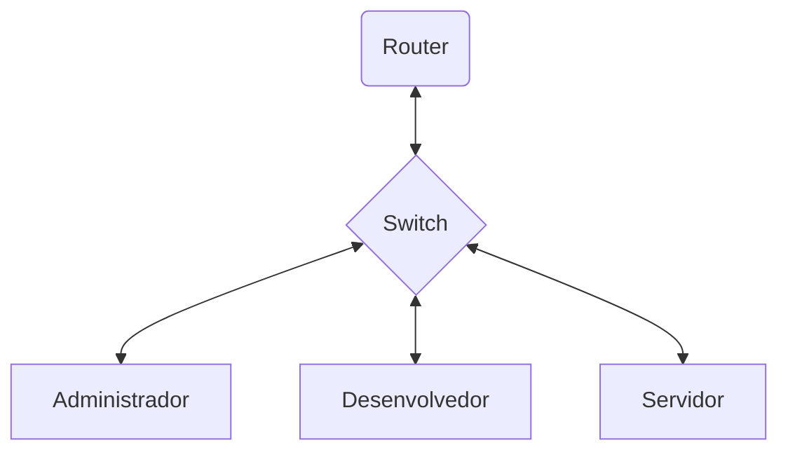
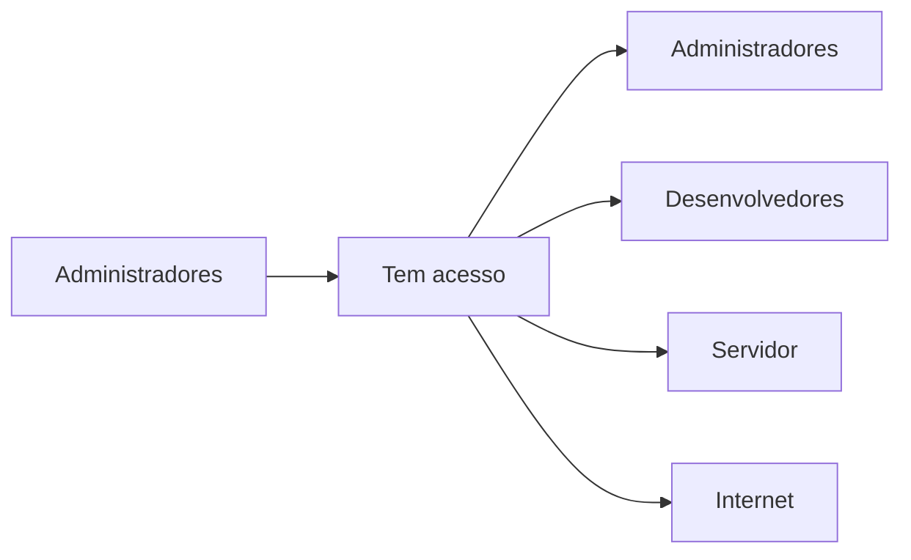
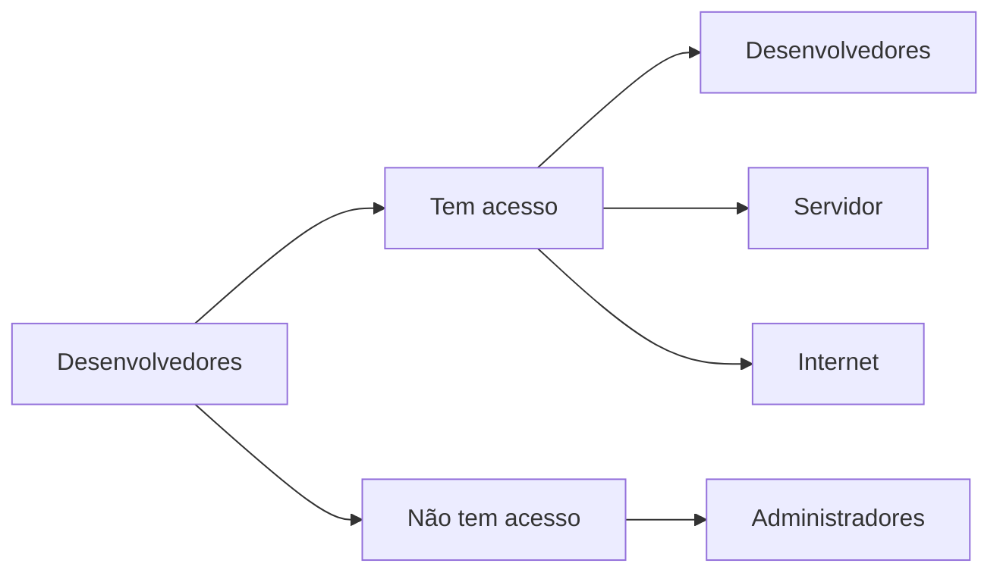
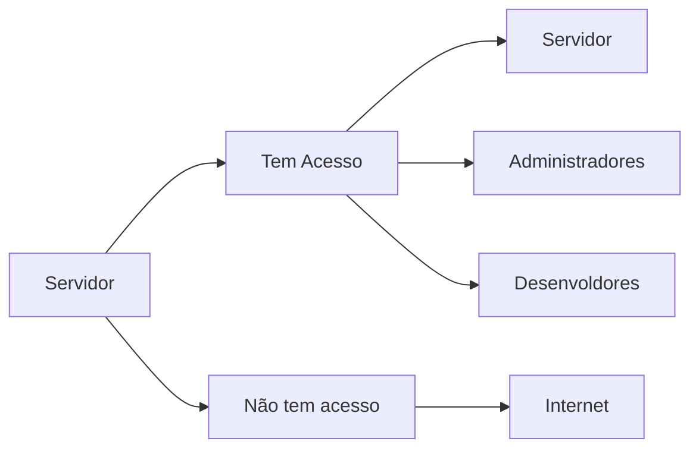
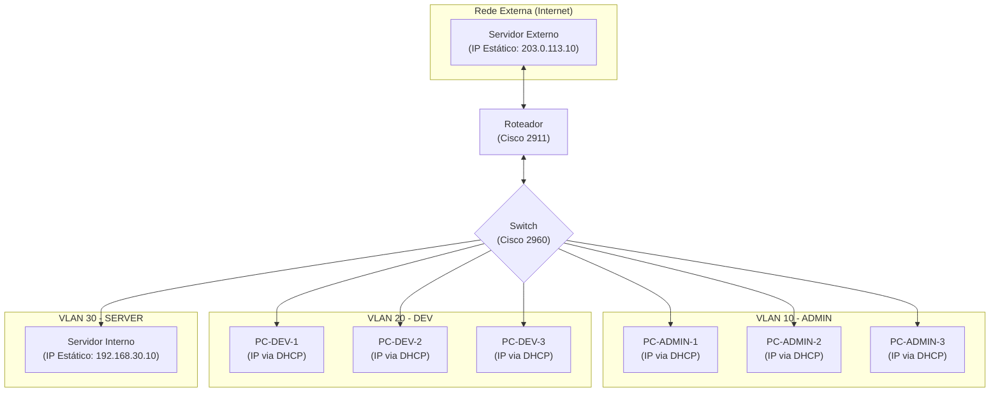

# Startup de Desenvolvimento Web - DevHub

## Descrição

A DevHub é uma startup que precisa de uma rede que conecte seus desenvolvedores, área administrativa e um servidor de hospedagem local para testes. Eles precisam de alta
disponibilidade, segurança no acesso aos servidores, e segmentação entre os setores para evitar
interferência no ambiente de desenvolvimento.

## Avaliação do Problema: Políticas de Acesso por VLAN

#### VLAN de Administração (VLAN\_ADMIN)

* **Acesso Permitido:** Acesso irrestrito à internet e a todas as outras VLANs da rede (Desenvolvedores, Servidores, etc.).
* **Acesso de Entrada:** Nenhuma outra VLAN tem permissão para iniciar comunicação com a VLAN de Administração.
* **Justificativa:** Esta VLAN possui os mais altos privilégios de acesso para garantir o total controle e gerenciamento da rede. Seu isolamento contra conexões iniciadas externamente protege a infraestrutura.

#### VLAN de Desenvolvimento (VLAN\_DEV)

* **Acesso Permitido:** Acesso liberado à internet e aos servidores internos para serviços de teste e hospedagem.
* **Acesso Bloqueado:** Comunicação iniciada com dispositivos da VLAN de Administração.
* **Justificativa:** Essa política permite que a equipe de desenvolvimento acesse os recursos necessários para seu trabalho, ao mesmo tempo que protege a rede administrativa contra acessos não autorizados.

#### VLAN de Servidores (VLAN\_SERVER)

* **Acesso Permitido:** Pode receber conexões da VLAN\_ADMIN e VLAN\_DEV para prover serviços internos.
* **Acesso Bloqueado:** Acesso à internet.
* **Justificativa:** O servidor é protegido contra tráfego externo, mas mantém conectividade interna para suportar o desenvolvimento e a administração.

<br>

---

| VLAN | Acesso à VLAN_ADMIN | Acesso à VLAN_DEV | Acesso à VLAN_SERVER | Acesso à Internet |
|-|:-:|:-:|:-:|:-:|
| Administrador |✅|✅|✅|✅|
| Desenvolvedor |❌|✅|✅|✅|
| Servidor      |✅|✅|✅|❌|


## Diagrama da Rede

### Diagrama de Comunicação: Geral



### Diagrama de Comunicação: Administradores



### Diagrama de Comunicação: Desenvolvedores



### Diagrama de Comunicação: Servidor



### Faixas de IP

A estratégia de endereçamento IP foi projetada para segmentar a rede de forma lógica e organizada. Foram utilizadas faixas de IP privadas da classe C (`192.168.x.x`), onde cada VLAN possui sua própria sub-rede para isolar o tráfego. A rede externa utiliza uma faixa de IP de documentação (`203.0.113.0/24`) para simular a conexão com a internet.

A tabela abaixo resume a alocação de endereços para cada segmento da rede.

| VLAN ID / Rede | Finalidade | Endereço de Rede | Gateway | Atribuição de IP | Observações |
| :--- | :--- | :--- | :--- | :--- | :--- |
| **VLAN 10** | Administração | `192.168.10.0/24` | `192.168.10.1` | DHCP | IPs de `.1` a `.9` reservados. |
| **VLAN 20** | Desenvolvimento | `192.168.20.0/24` | `192.168.20.1` | DHCP | IPs de `.1` a `.9` reservados. |
| **VLAN 30** | Servidores | `192.168.30.0/24` | `192.168.30.1` | Estático | IPs de `.1` a `.10` reservados para infraestrutura. |
| **VLAN 99** | Nativa do Trunk | N/A | N/A | N/A | VLAN de gerenciamento, sem dispositivos de usuário. |
| **Externa** | Simulação de Internet | `203.0.113.0/24` | `203.0.113.1` | Estático | Usada para conectar o roteador a um servidor externo. |

### **Dispositivos da Rede**

Esta seção detalha todos os equipamentos utilizados na topologia da DevHub, incluindo os dispositivos de infraestrutura (roteador e switch) e os dispositivos finais (servidores e computadores dos usuários).

#### Dispositivos de Infraestrutura

Os equipamentos a seguir formam o núcleo da rede, responsáveis pelo encaminhamento de pacotes, segmentação e segurança.

| Equipamento | Modelo | Função Principal |
| :--- | :--- | :--- |
| **Roteador** | Cisco 2911 ISR | Roteamento entre VLANs, Firewall (ACLs), Servidor DHCP e NAT. |
| **Switch** | Cisco Catalyst 2960 | Conexão dos dispositivos finais e segmentação da rede em VLANs. |

#### Diagrama de Topologia de Dispositivos

O diagrama abaixo ilustra a topologia da rede, agora identificando os modelos dos equipamentos de infraestrutura.



#### Dispositivos Finais (Hosts)

A tabela a seguir resume as características dos computadores e servidores conectados à rede.

| Dispositivo | VLAN / Rede | Endereço IP (Exemplo / Faixa) | Gateway | Método de Atribuição |
| :--- | :--- | :--- | :--- | :--- |
| **PC-ADMIN-1** | VLAN 10 (Admin) | `192.168.10.10` - `.254` | `192.168.10.1` | DHCP |
| **PC-ADMIN-2** | VLAN 10 (Admin) | `192.168.10.10` - `.254` | `192.168.10.1` | DHCP |
| **PC-ADMIN-3** | VLAN 10 (Admin) | `192.168.10.10` - `.254` | `192.168.10.1` | DHCP |
| **PC-DEV-1** | VLAN 20 (Dev) | `192.168.20.10` - `.254` | `192.168.20.1` | DHCP |
| **PC-DEV-2** | VLAN 20 (Dev) | `192.168.20.10` - `.254` | `192.168.20.1` | DHCP |
| **PC-DEV-3** | VLAN 20 (Dev) | `192.168.20.10` - `.254` | `192.168.20.1` | DHCP |
| **Servidor Interno** | VLAN 30 (Server) | `192.168.30.10` | `192.168.30.1` | Estático |
| **Servidor Externo**| Externa (Internet)| `203.0.113.10` | `203.0.113.1` | Estático |

## Configuração dos dispositivos

### **Configuração do Switch**

#### **0. Iniciar a Configuração**

Para começar a configuração do Switch você deve entrar no CLI do mesmo e utilizar o comando de habilitação e configuração.

```bash
enable
configure terminal
```

* `enable`: Entra no modo EXEC Privilegiado, que concede permissões para executar comandos de visualização e configuração.

* `configure terminal`: Entra no modo de Configuração Global, onde as alterações na configuração do dispositivo são feitas.

#### **1. Configuração do Link com o Roteador (Trunk)**

Este bloco configura a porta `GigabitEthernet0/0` para operar como um link "trunk", permitindo que o tráfego de múltiplas VLANs passe por ela.

```bash
interface GigabitEthernet0/0
    switchport mode trunk
    switchport trunk native vlan 99
    no shutdown
exit
```

* `interface GigabitEthernet0/0`: Acessa o modo de configuração específico para a interface física `GigabitEthernet0/0`.

* `switchport mode trunk`: Define a porta para operar permanentemente em modo "trunk". Isso a capacita a transportar tráfego de múltiplas VLANs simultaneamente, usando o protocolo de encapsulamento 802.1Q para identificar a qual VLAN cada quadro pertence.

* `switchport trunk native vlan 99`: Configura a VLAN nativa do trunk para a VLAN 99. Qualquer tráfego que cruze o trunk sem uma etiqueta 802.1Q (untagged) será automaticamente assumido como pertencente à VLAN 99. É uma prática de segurança para evitar que o tráfego de gerenciamento padrão (VLAN 1) seja exposto.

* `no shutdown`: Ativa administrativamente a interface, permitindo que ela envie e receba tráfego.

#### **2. Atribuição de Portas para a VLAN ADMIN**

Este bloco atribui as portas de `FastEthernet0/1` a `0/10` para a **VLAN 10 (ADMIN)**, colocando os dispositivos conectados nelas nessa rede.

```bash
interface range FastEthernet0/1 - 10
    switchport mode access
    switchport access vlan 10
    spanning-tree portfast
    no shutdown
exit
```

* `interface range FastEthernet0/1 - 10`: Acessa o modo de configuração para um intervalo de interfaces (de 1 a 10), permitindo aplicar os mesmos comandos a todas elas de uma só vez.

* `switchport mode access`: Define as portas para operarem em modo "access". Neste modo, uma porta pertence a uma única VLAN e não processa quadros com etiquetas 802.1Q. É o modo padrão para conectar dispositivos finais como PCs e servidores.

* `switchport access vlan 10`: Associa estaticamente as portas à VLAN 10. Qualquer dispositivo conectado a estas portas se tornará um membro da VLAN 10.

* `spanning-tree portfast`: Habilita o PortFast na interface. Este comando faz com que a porta pule os estados de "escuta" e "aprendizagem" do Spanning Tree Protocol (STP), permitindo que ela transite imediatamente para o estado de "encaminhamento". Isso evita que dispositivos finais (como PCs que usam DHCP) tenham problemas de timeout ao obter um IP quando conectados.

#### **3. Atribuição de Portas para a VLAN DEV**

Este bloco atribui as portas de `FastEthernet0/11` a `0/20` para a **VLAN 20 (DEV)**.

```bash
interface range FastEthernet0/11 - 20
    switchport mode access
    switchport access vlan 20
    spanning-tree portfast
    no shutdown
exit
```

* Mesma lógica do bloco anterior, porém com os respectivos valores e intervalos alterados

#### **4. Atribuição de Porta para a VLAN SERVER**

Este bloco atribui a porta `FastEthernet0/21` para a **VLAN 30 (SERVER)**.

```bash
interface FastEthernet0/21
    switchport mode access
    switchport access vlan 30
    spanning-tree portfast
    no shutdown
exit
```

* Mesma lógica do bloco anterior, porém com os respectivos valores e intervalos alterados

#### **5. Finalizar a Configuração**

Para finalizar a configuração basta usar o comando `end` do bloco abaixo.

```bash
end
```

* `end`: Sai do modo de configuração e retorna ao modo EXEC Privilegiado.

-----

### **Configuração do Roteador**

#### **0. Iniciar a Configuração**

Para começar a configuração do Router você deve entrar no CLI do mesmo e utilizar o comando de habilitação e configuração.

```bash
enable
configure terminal
```

* `enable`: Entra no modo EXEC Privilegiado, que concede permissões para executar comandos de visualização e configuração.

* `configure terminal`: Entra no modo de Configuração Global, onde as alterações na configuração do dispositivo são feitas.

#### **1. Criação dos Gateways para as VLANs**

Este bloco cria as sub-interfaces virtuais que servirão como gateway padrão para cada VLAN, permitindo a comunicação entre elas.

```bash
interface GigabitEthernet0/0
    no shutdown
exit

interface GigabitEthernet0/0.10
    encapsulation dot1Q 10
    ip address 192.168.10.1 255.255.255.0
exit

interface GigabitEthernet0/0.20
    encapsulation dot1Q 20
    ip address 192.168.20.1 255.255.255.0
exit

interface GigabitEthernet0/0.30
    encapsulation dot1Q 30
    ip address 192.168.30.1 255.255.255.0
exit
```

* `interface GigabitEthernet0/0`: Acessa a interface física principal que se conecta ao switch. Em uma configuração "Router-on-a-Stick", esta interface não recebe um endereço IP.

* `no shutdown`: Ativa a interface física. As sub-interfaces virtuais só funcionarão se a interface física principal estiver ativa.

* `interface GigabitEthernet0/0.10`: Cria uma sub-interface lógica (virtual) associada à interface física `Gi0/0`. O número `.10` é arbitrário, mas por convenção, corresponde ao ID da VLAN que ela servirá. O mesmo vale para as demais linhas semelhantes a essa, porém com seus respectivos valores.

* `encapsulation dot1Q 10`: Habilita o encapsulamento 802.1Q na sub-interface e a associa à VLAN de ID 10. Isso diz ao roteador para processar quadros que chegam com a etiqueta da VLAN 10. O mesmo vale para as demais linhas semelhantes a essa, porém com seus respectivos valores.

* `ip address 192.168.10.1 255.255.255.0`: Atribui um endereço IP e máscara de sub-rede à sub-interface, estabelecendo-a como o gateway padrão para todos os dispositivos na VLAN 10. O mesmo vale para as demais linhas semelhantes a essa, porém com seus respectivos valores.

#### **2. Configuração do Servidor DHCP**

Este bloco configura o roteador para distribuir endereços IP automaticamente para as VLANs ADMIN e DEV, reservando os primeiros IPs de cada rede.

```bash
ip dhcp excluded-address 192.168.10.1 192.168.10.9
ip dhcp excluded-address 192.168.20.1 192.168.20.9
ip dhcp excluded-address 192.168.30.1 192.168.30.10

ip dhcp pool VLAN10_ADMIN
   network 192.168.10.0 255.255.255.0
   default-router 192.168.10.1
   dns-server 8.8.8.8
exit

ip dhcp pool VLAN20_DEV
    network 192.168.20.0 255.255.255.0
    default-router 192.168.20.1
    dns-server 8.8.8.8
exit
```

* `ip dhcp excluded-address ...`: Reserva um intervalo de endereços IP, instruindo o serviço DHCP a nunca distribuí-los automaticamente. Isso é usado para reservar IPs para gateways, servidores e outros dispositivos de infraestrutura com IPs estáticos.

* `ip dhcp pool VLAN10_ADMIN`: Cria um conjunto de configurações DHCP (pool) com um nome descritivo. Mesma lógica se aplica à outra linha semelhante

* `network 192.168.10.0 255.255.255.0`: Define a sub-rede da qual o pool DHCP distribuirá endereços IP. Mesma lógica se aplica à outra linha semelhante

* `default-router 192.168.10.1`: Especifica o endereço do gateway padrão que será fornecido aos clientes DHCP. Mesma lógica se aplica à outra linha semelhante

* `dns-server 8.8.8.8`: Especifica o endereço do servidor DNS que será fornecido aos clientes.

#### **3. Firewall de Segurança para a VLAN DEV**

Este bloco cria e aplica uma lista de acesso (ACL) que permite à VLAN DEV acessar o servidor e a internet, mas a proíbe de se comunicar com a VLAN ADMIN.

```bash
ip access-list extended DEV_SECURITY_POLICY
    permit icmp 192.168.20.0 0.0.0.255 192.168.10.0 0.0.0.255 echo-reply
    permit tcp 192.168.20.0 0.0.0.255 192.168.10.0 0.0.0.255 established
    permit tcp 192.168.20.0 0.0.0.255 host 192.168.30.10 eq 80
    permit tcp 192.168.20.0 0.0.0.255 host 192.168.30.10 eq 443
    permit tcp 192.168.20.0 0.0.0.255 host 192.168.30.10 eq 22
    deny   ip 192.168.20.0 0.0.0.255 192.168.10.0 0.0.0.255
    permit ip any any
exit

interface GigabitEthernet0/0.20
    ip access-group DEV_SECURITY_POLICY in
exit
```

* `ip access-list extended DEV_SECURITY_POLICY`: Cria uma Access Control List (ACL) nomeada e do tipo estendida, que permite filtrar tráfego com base no protocolo, endereços de origem e destino, e portas.

* `permit icmp ... echo-reply`: Permite que a rede DEV envie respostas de ping (ICMP echo-reply) para a rede ADMIN. Isso é necessário para que um ping iniciado pelo ADMIN funcione.

* `permit tcp ... established`: É uma regra de ACL reflexiva. Ela permite o tráfego de retorno de uma sessão TCP que já foi estabelecida. Essencialmente, se um ADMIN inicia uma conexão com um DEV, esta regra permite que o DEV responda.

* `deny ip 192.168.20.0 0.0.0.255 192.168.10.0 0.0.0.255`: Esta é a regra de segurança explícita que **nega** qualquer tipo de tráfego IP (`ip`) que venha da rede de desenvolvedores (`192.168.20.0`) e tente uma conexão com a rede de administradores (`192.168.10.0`).

* `permit ip any any`: Permite todo o resto do tráfego. Sem esta linha, a "negação implícita" no final de toda ACL bloquearia qualquer outro tráfego (como o acesso à internet).

* `ip access-group DEV_SECURITY_POLICY in`: Aplica a ACL à sub-interface da VLAN 20 na direção de entrada (`in`). Isso significa que o tráfego será filtrado no momento em que ele chega ao roteador vindo da rede DEV.

#### **4. Firewall de Saída e NAT para a Internet**

Este bloco de código é responsável por configurar como a rede interna da DevHub acessa a rede externa (a "internet" simulada). Ele realiza duas funções críticas:

1.  **NAT (Network Address Translation):** Traduz os endereços IP privados das VLANs de Administração e Desenvolvimento em um único endereço IP "público", permitindo que eles se comuniquem com o exterior.
2.  **Firewall:** Cria e aplica uma lista de acesso (ACL) para garantir que apenas o tráfego autorizado (das VLANs ADMIN e DEV) possa sair para a internet, bloqueando explicitamente a VLAN do Servidor.

```bash
interface GigabitEthernet0/1
    ip address 203.0.113.1 255.255.255.0
    ip nat outside
    no shutdown
exit

ip access-list standard NAT_ACL
    permit 192.168.10.0 0.0.0.255
    permit 192.168.20.0 0.0.0.255
exit

ip nat inside source list NAT_ACL interface GigabitEthernet0/1 overload

interface GigabitEthernet0/0.10
    ip nat inside
exit

interface GigabitEthernet0/0.20
    ip nat inside
exit

ip access-list extended ACL_INTERNET_OUT
    deny ip 192.168.30.0 0.0.0.255 any
    permit ip any any
exit

interface GigabitEthernet0/1
    ip access-group ACL_INTERNET_OUT out
exit
```

  * `interface GigabitEthernet0/1`: Acessa o modo de configuração da interface física que se conecta à rede externa (WAN).

  * `ip address 203.0.113.1 255.255.255.0`: Define um endereço IP estático para a interface externa. Este será o endereço "público" que representará toda a sua rede interna na comunicação com servidores externos.

  * `ip nat outside`: Comando crucial que designa esta interface como a "fronteira externa" da sua rede para o serviço de NAT.

  * `ip access-list standard NAT_ACL`: Cria uma Lista de Acesso (ACL) do tipo *standard* chamada `NAT_ACL`. ACLs do tipo standard filtram o tráfego baseando-se unicamente no endereço IP de **origem**.

  * `permit 192.168.10.0 0.0.0.255`: Dentro da `NAT_ACL`, esta linha permite que qualquer tráfego originado da rede da VLAN ADMIN (`192.168.10.0/24`) seja candidato a passar pelo processo de NAT. O mesmo se aplica à linha seguinte para a VLAN DEV (`192.168.20.0/24`). Note que a rede de servidores (`192.168.30.0/24`) **não** foi incluída, sendo este o primeiro passo para impedir seu acesso à internet.

  * `ip nat inside source list NAT_ACL interface GigabitEthernet0/1 overload`: Este é o comando central que ativa o NAT.

      * `ip nat inside source`: Instruí o roteador a traduzir o IP de origem do tráfego que vem de dentro (`inside`).
      * `list NAT_ACL`: Especifica que apenas o tráfego permitido pela ACL `NAT_ACL` deve ser traduzido.
      * `interface GigabitEthernet0/1`: Define que o endereço IP a ser usado na tradução é o da interface `GigabitEthernet0/1` (`203.0.113.1`).
      * `overload`: Habilita o **PAT (Port Address Translation)**, permitindo que múltiplos dispositivos internos compartilhem o único IP público da `GigabitEthernet0/1` simultaneamente.

  * `ip nat inside`: Aplicado dentro das sub-interfaces das VLANs ADMIN (`Gi0/0.10`) e DEV (`Gi0/0.20`), este comando as designa como interfaces "internas". Qualquer tráfego que se origine nelas e vá para uma interface `ip nat outside` será processado pela regra de NAT.

  * `ip access-list extended ACL_INTERNET_OUT`: Cria uma ACL do tipo *extended* chamada `ACL_INTERNET_OUT`. ACLs do tipo extended são mais poderosas, permitindo filtrar o tráfego com base na origem, destino, protocolo e portas.

  * `deny ip 192.168.30.0 0.0.0.255 any`: Esta é a regra de segurança explícita que **nega** qualquer tipo de tráfego IP (`ip`) que venha da rede de servidores (`192.168.30.0/24`) e tente ir para **qualquer** destino (`any`).

  * `permit ip any any`: Após a regra de negação, esta linha é fundamental para **permitir** todo o restante do tráfego (ou seja, o tráfego das VLANs ADMIN e DEV que já passaram pelo filtro do NAT). Sem ela, todo o tráfego seria bloqueado pela regra invisível de "negação implícita" que existe no final de toda ACL.

  * `ip access-group ACL_INTERNET_OUT out`: Aplica a ACL `ACL_INTERNET_OUT` à interface `GigabitEthernet0/1` na direção de **saída** (`out`). Isso significa que as regras da ACL serão verificadas para cada pacote que estiver prestes a sair do roteador em direção à internet.

#### **5. Finalizar a Configuração**

Para finalizar a configuração basta usar o comando `end` do bloco abaixo.

```bash
end
```

* `end`: Sai do modo de configuração e retorna ao modo EXEC Privilegiado.

### Plano de Testes e Verificação

Este plano fornece uma série de testes sistemáticos para validar a configuração da rede da DevHub. O objetivo é confirmar que todas as regras de comunicação e políticas de segurança entre as VLANs e o acesso à internet estão funcionando conforme o esperado.

Os testes devem ser executados a partir de um dispositivo em cada uma das VLANs principais.

#### Testes a partir da VLAN 10 (ADMIN)

Um PC conectado a uma porta da VLAN ADMIN (ex: `PC-ADMIN-1` com IP `192.168.10.10`) deve ter acesso irrestrito.

| Nº | Origem | Destino | Comando / Ação | Resultado Esperado | Justificativa da Regra |
| :--- | :--- | :--- | :--- | :--- | :--- |
| 1.1 | PC-ADMIN-1 | PC-DEV-1 | `ping 192.168.20.10` | **Sucesso** | A VLAN ADMIN tem permissão total de acesso às outras VLANs. |
| 1.2 | PC-ADMIN-1 | Servidor Interno | `ping 192.168.30.10` | **Sucesso** | A VLAN ADMIN pode acessar o servidor interno. |
| 1.3 | PC-ADMIN-1 | Servidor Interno | Abrir `http://192.168.30.10/index.html` | **Página carrega** | Acesso web ao servidor interno é permitido para administradores. |
| 1.4 | PC-ADMIN-1 | Servidor Externo | `ping 203.0.113.10` | **Sucesso** | A VLAN ADMIN tem acesso à internet (via NAT). |
| 1.5 | PC-ADMIN-1 | Servidor Externo | Abrir `http://203.0.113.10/index.html` | **Página carrega** | Acesso web à internet é permitido. |

#### Testes a partir da VLAN 20 (DEV)

Um PC conectado a uma porta da VLAN DEV (ex: `PC-DEV-1` com IP `192.168.20.10`) deve ter acesso à internet e ao servidor, mas ser bloqueado de acessar a VLAN ADMIN.

| Nº | Origem | Destino | Comando / Ação | Resultado Esperado | Justificativa da Regra |
| :--- | :--- | :--- | :--- | :--- | :--- |
| 2.1 | PC-DEV-1 | PC-ADMIN-1 | `ping 192.168.10.10` | **Falha** (Time out) | A regra `deny ip ...` na ACL `DEV_SECURITY_POLICY` bloqueia a comunicação iniciada da VLAN DEV para a ADMIN. |
| 2.2 | PC-DEV-1 | Servidor Interno | `ping 192.168.30.10` | **Sucesso** | Desenvolvedores podem acessar o servidor interno. |
| 2.3 | PC-DEV-1 | Servidor Interno | Abrir `http://192.168.30.10/index.html` | **Página carrega** | A regra `permit tcp ... eq 80` na ACL `DEV_SECURITY_POLICY` autoriza o acesso web. |
| 2.4 | PC-DEV-1 | Servidor Externo | `ping 203.0.113.10` | **Sucesso** | A VLAN DEV tem acesso à internet (via NAT). |
| 2.5 | PC-DEV-1 | Servidor Externo | Abrir `http://203.0.113.10/index.html` | **Página carrega** | Acesso web à internet é permitido para desenvolvedores. |

#### Testes a partir da VLAN 30 (SERVER)

O Servidor Interno (`192.168.30.10`) deve poder responder a requisições internas, mas ser incapaz de iniciar comunicação com a internet.

| Nº | Origem | Destino | Comando / Ação | Resultado Esperado | Justificativa da Regra |
| :--- | :--- | :--- | :--- | :--- | :--- |
| 3.1 | Servidor Interno | PC-ADMIN-1 | `ping 192.168.10.10` | **Sucesso** | O servidor pode se comunicar com a rede interna. |
| 3.2 | Servidor Interno | PC-DEV-1 | `ping 192.168.20.10` | **Sucesso** | O servidor pode se comunicar com a rede interna. |
| 3.3 | Servidor Interno | Servidor Externo | `ping 203.0.113.10` | **Falha** (Time out) | A regra `deny ip 192.168.30.0 ... any` na ACL `ACL_INTERNET_OUT` bloqueia qualquer tráfego do servidor para a internet. |
| 3.4 | Servidor Interno | DNS Público | `nslookup google.com` | **Falha** | A mesma regra da `ACL_INTERNET_OUT` também bloqueia requisições DNS para a internet. |

A execução bem-sucedida de todos os testes deste plano confirma que a rede da DevHub está segmentada e protegida de acordo com as políticas estabelecidas.